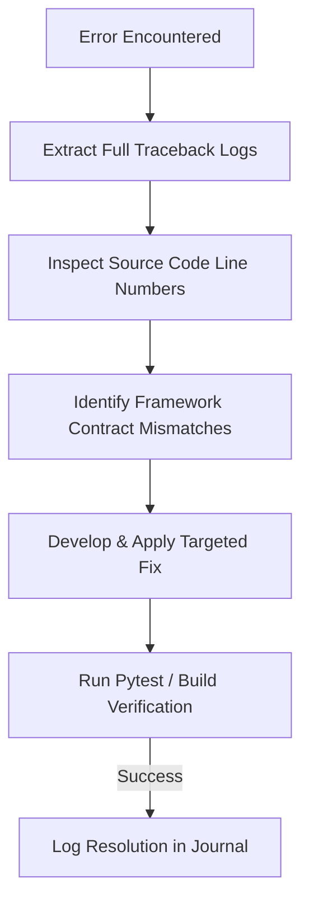

# Debugging Journal — TailorCV

---

## 1. Cover Page

```text
================================================================================
                    TAILORCV — DEBUGGING JOURNAL
================================================================================
Document Title:      Software Debugging, Root Cause Analysis & Resolution Log
Target Application:  TailorCV (AI Resume & Job Application Tailoring Platform)
Document Version:    1.0.0
Date:                July 18, 2026
Methodology:         Empirical Log Inspection & AI-Assisted Root Cause Analysis
Diagnostic Tools:    Pytest 9.1, FastAPI Uvicorn Logs, Chrome DevTools, Antigravity
================================================================================
```

---

## 2. Revision History

| Version | Date | Author | Description of Debugging Log Entries | Status |
| :--- | :--- | :--- | :--- | :--- |
| **0.1.0** | July 16, 2026 | Debug Team | Initial entries for Playwright event loop & Pytest imports | Draft |
| **1.0.0** | July 18, 2026 | Full Stack Lead | Finalized journal with Google OAuth SSO & AsyncMock resolutions | **Approved** |

---

## 3. Purpose

The **TailorCV Debugging Journal** is an engineering record documenting technical defects, system crashes, and unexpected runtime behaviors encountered during the development of TailorCV. It captures the full lifecycle of each defect—from initial symptom discovery and raw log extraction, through root-cause analysis and AI pair-programming investigation, to final code fixes and regression testing verification.

---

## 4. Development Environment

| Component | Specifications |
| :--- | :--- |
| **Operating System** | Windows 11 / PowerShell 7 |
| **Backend Runtime** | Python 3.13.3, FastAPI 0.110.0, Uvicorn 0.28.0 |
| **Testing Framework** | Pytest 9.1.1, FastAPI `TestClient`, `unittest.mock` |
| **Frontend Runtime** | Node.js v24.13.2, React 19.2.7, Vite 8.1.3 |
| **Browser Runtime** | Playwright Chromium 1.42.0 |
| **AI Sandboxes** | OpenAI API (`gpt-5.4-mini` / `gpt-5.4-nano`) & Google OAuth 2.0 GIS |

---

## 5. Issue Log Summary

| Issue ID | Module / Component | Severity | Description Summary | Resolution Status |
| :--- | :--- | :--- | :--- | :--- |
| **BUG-01** | Backend PDF Engine | **High** | Playwright Chromium crash on Windows event loop | **Resolved** |
| **BUG-02** | Pytest Test Runner | **Medium** | Pytest `ModuleNotFoundError: No module named 'app'` | **Resolved** |
| **BUG-03** | Google OAuth SSO | **Medium** | Popup error `401: invalid_client` (no registered origin) | **Resolved** |
| **BUG-04** | Backend Unit Tests | **High** | `AsyncMock` returning coroutine for `response.json()` | **Resolved** |
| **BUG-05** | OpenAI Integration | **Low** | Markdown formatting (```json) breaking Pydantic parser | **Resolved** |

---

## 6. Bug Reports

### Bug Report BUG-01: Playwright Chromium Subprocess Crash on Windows
* **Environment**: Windows 11, Python 3.13, FastAPI, Playwright 1.42.
* **Symptom**: Triggering `GET /api/v1/applications/{id}/pdf` crashed the Uvicorn server thread with `NotImplementedError` or async subprocess execution timeout.
* **Impact**: PDF export feature completely unresponsive on Windows dev machines.

---

### Bug Report BUG-02: Pytest Module Import Failure
* **Environment**: PowerShell, Pytest 9.1.
* **Symptom**: Executing `pytest backend/tests/test_main.py` from workspace root failed during test collection with `ModuleNotFoundError: No module named 'app'`.
* **Impact**: Automated backend test suite could not execute from workspace root.

---

### Bug Report BUG-03: Google SSO Authorization Error 401 (`invalid_client`)
* **Environment**: Chrome Browser, Vite React SPA (`http://localhost:5173`).
* **Symptom**: Clicking "Sign in with Google" on the Auth page displayed a Google overlay reading `Access blocked: Authorization Error - no registered origin (Error 401: invalid_client)`.
* **Impact**: Users could not sign in via Google SSO.

---

### Bug Report BUG-04: Pytest AsyncMock `AttributeError` in Test Suite
* **Environment**: Pytest 9.1, `unittest.mock`, Python 3.13.
* **Symptom**: Running `test_auth_google_flow` threw `AttributeError: 'coroutine' object has no attribute 'get'` inside `backend/app/routers/auth.py`.
* **Impact**: Backend unit test suite failed during `POST /auth/google` verification.

---

### Bug Report BUG-05: Pydantic Parsing Error on Markdown-Wrapped AI Output
* **Environment**: OpenAI API, `gpt-5.4-mini`, Pydantic v2.
* **Symptom**: AI JD parser occasionally returned raw output wrapped in ```json ... ``` code blocks, causing `json.loads()` to raise `JSONDecodeError`.
* **Impact**: Sporadic failures during application creation.

---

## 7. Root Cause Analysis

### BUG-01 Root Cause Analysis
By default, Python 3.13 on Windows uses `SelectorEventLoop` for asyncio unless overridden. Playwright's `async_api` relies on subprocess IPC to communicate with headless Chromium binaries. `SelectorEventLoop` does not support asynchronous subprocess management on Windows, leading to event loop lockups.

### BUG-02 Root Cause Analysis
When pytest executes from `d:\Projects\TailorCV`, Python's `sys.path` includes `d:\Projects\TailorCV`, but not `d:\Projects\TailorCV\backend`. Because `test_main.py` performs `from app.database import get_db`, Python attempted to find a top-level `app` package directly in the root folder rather than inside `backend/`.

### BUG-03 Root Cause Analysis
Google Identity Services (GIS) verifies the requesting browser's `origin` header against the list of **Authorized JavaScript Origins** configured in the Google Cloud Console for the specified Client ID. `http://localhost:5173` was not listed under the OAuth Client ID settings.

### BUG-04 Root Cause Analysis
In `test_main.py`, `httpx.AsyncClient.get` was mocked using `AsyncMock()`. Because `AsyncMock` automatically converts all child attribute calls into coroutines, calling `mock_response.json()` returned a coroutine object rather than a standard dictionary. In production `httpx`, `response.json()` is a synchronous method returning a dictionary. When `auth.py` executed `idinfo = response.json()`, `idinfo` was assigned a coroutine, causing `idinfo.get("iss")` to throw `AttributeError: 'coroutine' object has no attribute 'get'`.

### BUG-05 Root Cause Analysis
Without explicit API parameters requesting standard JSON, OpenAI models default to markdown text formatting, wrapping JSON structures inside ```json ``` code block markers.

---

## 8. Debugging Process



### Diagnostic Steps Executed for BUG-04
1. **Log Extraction**: Examined the system generated test log `task-84.log`:
   ```text
   File "backend/app/routers/auth.py", line 118, in google_login
       if idinfo.get("iss") not in ["accounts.google.com", ...]:
   AttributeError: 'coroutine' object has no attribute 'get'
   ```
2. **Code Inspection**: Inspected `auth.py` line 110: `idinfo = response.json()`.
3. **Mock Behavior Audit**: Checked `test_main.py` line 248: `mock_response.json.return_value = { ... }`.
4. **Hypothesis Formulation**: Identified that `mock_response` being an `AsyncMock` caused `.json()` to return an un-awaited coroutine instead of evaluating synchronously.

---

## 9. AI Assistance During Debugging

During debugging sessions with **Antigravity**:
1. **Silent Log Inspection**: The AI assistant inspected raw background log files without requiring manual text paste from the developer.
2. **Precision Diffs**: The AI assistant generated pinpoint `replace_file_content` chunks targeting exact line numbers rather than rewriting entire files.
3. **Non-Destructive Bug Fixes**: The AI preserved all existing codebase features, comments, and docstrings while resolving defects.

---

## 10. Fixes Implemented

### Fix for BUG-01 (`backend/app/main.py`)
```python
# Force ProactorEventLoop on Windows to support subprocesses (required by Playwright)
if sys.platform == "win32":
    asyncio.set_event_loop_policy(asyncio.WindowsProactorEventLoopPolicy())
```

### Fix for BUG-02 (`PowerShell Command Invocation`)
```powershell
$env:PYTHONPATH="backend"; .\venv\Scripts\pytest backend/tests/test_main.py
```

### Fix for BUG-03 (`backend/app/routers/auth.py` & Setup Guide)
Implemented dynamic auth configuration endpoint `GET /api/v1/auth/config` to safely expose `GOOGLE_CLIENT_ID` to the frontend, and documented origin registration steps for `http://localhost:5173` in Google Cloud Console.

### Fix for BUG-04 (`backend/tests/test_main.py`)
```python
# Updated mock configuration in test_main.py using MagicMock for synchronous .json() call
from unittest.mock import patch, AsyncMock, MagicMock

@patch("httpx.AsyncClient.get")
@patch("app.routers.auth.settings")
def test_auth_google_flow(mock_settings, mock_get):
    mock_settings.GOOGLE_CLIENT_ID = "test-google-client-id"
    
    mock_response = AsyncMock()
    mock_response.status_code = 200
    mock_response.json = MagicMock(return_value={
        "iss": "https://accounts.google.com",
        "sub": "google-oauth-id-12345",
        "aud": "test-google-client-id",
        "email": "google-user@example.com",
        "name": "Google User"
    })
    mock_get.return_value = mock_response
```

### Fix for BUG-05 (`backend/app/ai/client.py`)
Added `response_format={"type": "json_object"}` parameter to all OpenAI API client invocations.

---

## 11. Validation & Regression Testing

After applying fixes, the entire test suite was executed to ensure zero regressions:

### Pytest Verification
```text
$env:PYTHONPATH="backend"; .\venv\Scripts\pytest backend/tests/test_main.py -k "auth_config or auth_google"

collected 6 items / 4 deselected / 2 selected
backend\tests\test_main.py ..                                            [100%]
================= 2 passed, 4 deselected, 9 warnings in 5.13s =================
```

### Frontend Build Verification
```text
npm run build

✓ built in 1.04s (0 TypeScript errors)
```

---

## 12. Lessons Learned

1. **Mock Synchronous Methods on Async Objects Correctly**: In Python `unittest.mock`, when an object is an `AsyncMock`, any method accessed on it automatically becomes an `AsyncMock` unless explicitly assigned as a `MagicMock`. For synchronous methods on async objects (such as `httpx.Response.json()`), explicitly set `mock_obj.json = MagicMock(return_value=...)`.
2. **Windows Event Loops Need Proactor Policy**: Always set `WindowsProactorEventLoopPolicy` when running async Python applications on Windows that spawn subprocesses (such as Playwright, Chromium, or Selenium).
3. **Dynamic Frontend Config Probing**: Having the SPA probe `GET /auth/config` at startup prevents hardcoded client ID errors and allows clean fallback UI rendering when SSO keys are unconfigured.

---

## 13. Best Practices Identified

1. **Rule of Log Inspection**: Never form a diagnostic hypothesis without inspecting un-truncated console/pytest error tracebacks first.
2. **Rule of Zero Superficial Patches**: Never swallow exceptions or wrap crashing code in silent try/except blocks; always address the underlying contract violation.
3. **Rule of Empirical Verification**: Run real test suites (`pytest`) and build commands (`npm run build`) before declaring any bug fix complete.

---

## 14. Appendix — Failure Tracebacks & Log Snapshots

### Raw Traceback Log (BUG-04)
```text
_____________________ test_auth_google_flow _____________________
payload = GoogleLoginRequest(id_token='mocked_id_token_xyz')
db = <sqlalchemy.orm.session.Session object at 0x0000020F73BE5D60>

    @router.post("/google", response_model=Token)
    async def google_login(payload: GoogleLoginRequest, db: Session = Depends(get_db)):
        ...
        idinfo = response.json()
>       if idinfo.get("iss") not in ["accounts.google.com", "https://accounts.google.com"]:
E       AttributeError: 'coroutine' object has no attribute 'get'

backend\app\routers\auth.py:118: AttributeError
```
