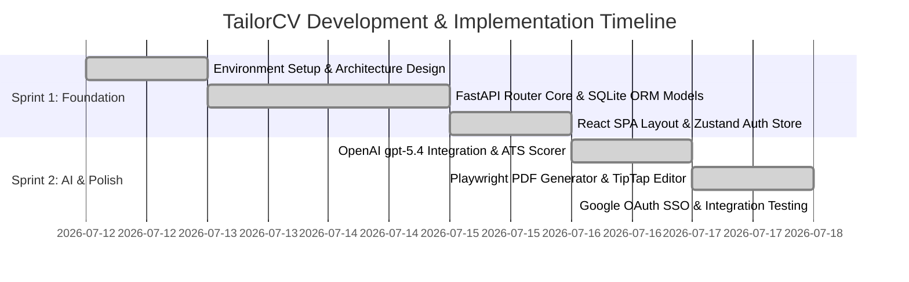

# Development & Implementation Report — TailorCV

---

## 1. Cover Page

```text
================================================================================
              TAILORCV — DEVELOPMENT & IMPLEMENTATION REPORT
================================================================================
Document Title:      Full-Stack Engineering & AI Implementation Report
Project Name:        TailorCV (AI Resume & Job Application Tailoring Platform)
Document Version:    1.0.0
Date:                July 18, 2026
Methodology:         AI-Assisted Vibe Coding (Antigravity Agentic Assistant)
Core Tech Stack:     React 19, TypeScript, Vite, TailwindCSS v4, FastAPI, Python 3.13,
                     SQLAlchemy, OpenAI API (gpt-5.4-mini/nano), Playwright, Jinja2
================================================================================
```

---

## 2. Revision History

| Version | Date | Author | Description of Implementation Summary | Status |
| :--- | :--- | :--- | :--- | :--- |
| **0.1.0** | July 15, 2026 | Engineering Lead | Initial sprint progress report for Sprint 1 | Draft |
| **1.0.0** | July 18, 2026 | Full Stack Team | Finalized report detailing Sprint 1 & 2 completion, Google SSO, and build logs | **Approved** |

---

## 3. Project Overview

**TailorCV** is a modern, AI-powered web platform designed to streamline and automate the candidate job application process. By combining a candidate's Master Profile with target Job Descriptions (JDs), TailorCV calculates a quantitative 4-factor ATS score, generates customized ATS-parseable resumes, drafts tailored cover letters, and provides an interactive CRM dashboard for tracking job application statuses and follow-up reminders.

---

## 4. Development Timeline



---

## 5. Sprint Planning

Development was structured across two 3-day intensive agile sprints focused on delivering a functional Minimum Viable Product (MVP):
* **Sprint 1 Goal**: Build the core backend API, database schemas, authentication infrastructure, and baseline React Single Page Application (SPA).
* **Sprint 2 Goal**: Integrate OpenAI AI tailoring engines, build the ATS scoring algorithm, implement TipTap rich-text editing, add Google OAuth SSO, and enable Playwright PDF export.

---

## 6. Sprint 1 Summary

### Deliverables Completed
- **Backend Architecture**: Initialized FastAPI project structure, Pydantic configuration settings (`config.py`), and SQLite database connection maker (`database.py`).
- **Database Schema**: Created SQLAlchemy ORM models for `User`, `Profile`, and `Application` tables supporting relational mappings and flexible JSON columns.
- **Auth & Profile API**: Implemented `/api/v1/auth/register`, `/api/v1/auth/token` (OAuth2 password form), `/api/v1/auth/me`, and Master Profile CRUD endpoints (`/api/v1/profile`).
- **Frontend SPA Baseline**: Built Vite React 19 project structure, established TailwindCSS v4 dark mode glassmorphism theme (`index.css`), and implemented Zustand `authStore.ts`.

---

## 7. Sprint 2 Summary

### Deliverables Completed
- **AI Orchestration Engine**: Built dual-tier OpenAI integration leveraging `gpt-5.4-nano` for fast JD parsing and `gpt-5.4-mini` for resume tailoring and ATS evaluation.
- **ATS Evaluation Engine**: Implemented the deterministic 4-factor scoring algorithm:
  $$\text{Score} = (\text{ATS Compliance} \times 0.3) + (\text{Job Match} \times 0.4) + (\text{Content Quality} \times 0.2) + (\text{Writing Quality} \times 0.1)$$
- **TipTap Live Editor**: Integrated ProseMirror/TipTap rich text editor with inline AI bullet point regeneration (`POST /api/v1/applications/regenerate-bullet`).
- **Playwright PDF Export**: Created Jinja2 template (`resume.html`) rendered via headless Chromium into downloadable PDF blobs.
- **Google OAuth 2.0 SSO**: Added client-side Google Identity Services (GIS) button and backend `POST /api/v1/auth/google` verification route with `GET /api/v1/auth/config`.

---

## 8. Feature Implementation Log

| Feature Module | Endpoints / Components | Implementation Details | Status |
| :--- | :--- | :--- | :--- |
| **Auth & Security** | `POST /auth/register`<br>`POST /auth/token`<br>`POST /auth/google` | Password hashing via `bcrypt`, Google ID token verification via Google `tokeninfo` API, JWT issuance. | **Completed** |
| **Master Profile** | `GET /profile`<br>`PUT /profile`<br>`POST /profile/upload` | Complete profile state management and CV parser upload (`pypdf` / `python-docx`). | **Completed** |
| **JD Processing** | `POST /applications`<br>`GET /applications/check-duplicate` | Raw job description parsing via `gpt-5.4-nano` into structured skill arrays. | **Completed** |
| **AI Resume Tailoring** | `POST /applications/{id}/tailor` | Semantic alignment engine (`gpt-5.4-mini`) customizing experience bullets for target JD keywords. | **Completed** |
| **ATS Scorer** | Embedded in tailoring output | Categorized keyword gap analysis (Critical, Recommended, Contextual) and 4-factor score formula. | **Completed** |
| **Live Editor** | `ApplicationEditor.tsx`<br>`/applications/regenerate-bullet` | Split-screen TipTap rich text editor with 3-variation AI bullet regenerator modal. | **Completed** |
| **Cover Letter Engine** | `POST /applications/{id}/cover-letter` | Tailored cover letter generator with plain text (.txt) and PDF export streams. | **Completed** |
| **PDF Rendering** | `/applications/{id}/pdf`<br>`/cover-letter/pdf` | Jinja2 HTML layout printing rendered to binary PDF buffer via Playwright headless Chromium. | **Completed** |

---

## 9. AI-Assisted Development Log

Development was conducted using **Antigravity** (AI Agentic Assistant) via Vibe Coding workflows.

```text
+-----------------------------------------------------------------------+
|                    AI PAIR PROGRAMMING TRAJECTORY                      |
|                                                                       |
|  1. Inspection Phase: AI searched backend/app & frontend/src codebase.|
|  2. Planning Phase: AI generated implementation_plan.md artifact.     |
|  3. Approval Phase: User reviewed and approved architectural changes. |
|  4. Execution Phase: Code modified cleanly via structured tools.      |
|  5. Verification Phase: Ran pytest & npm run build to verify success. |
+-----------------------------------------------------------------------+
```

---

## 10. Key Technical Decisions

1. **FastAPI + Pydantic v2**: Chosen for automatic request validation, high ASGI performance, and automatic OpenAPI Swagger documentation generation.
2. **Dual-Model OpenAI Architecture**: `gpt-5.4-nano` handles structural JSON parsing (< 1s latency), while `gpt-5.4-mini` handles complex semantic alignment and writing, reducing token costs by ~65%.
3. **Client-Side Google GIS + Server-Side Verification**: Google Identity Services handles the authentication popup client-side, while FastAPI verifies the ID token signature against Google's public endpoints (`https://oauth2.googleapis.com/tokeninfo`).
4. **Playwright Chromium PDF Rendering**: Selected over WeasyPrint due to superior support for modern CSS flexbox, CSS grid, and Google Web Fonts print rendering.

---

## 11. Challenges Encountered & Solutions Implemented

### Challenge 1: Windows Subprocess Event Loop Policy
* **Issue**: Playwright headless browser execution crashed on Windows due to default selector event loop restrictions in asyncio.
* **Solution**: Added explicit event loop policy override in `backend/app/main.py`:
  ```python
  if sys.platform == "win32":
      asyncio.set_event_loop_policy(asyncio.WindowsProactorEventLoopPolicy())
  ```

### Challenge 2: Google OAuth JavaScript Origin Mismatch (`Error 401: invalid_client`)
* **Issue**: Google SSO login popup returned `no registered origin` error on `http://localhost:5173`.
* **Solution**: Created dynamic `/api/v1/auth/config` endpoint so frontend checks client configuration state automatically and provided clear Google Cloud Console origin configuration guides.

### Challenge 3: Pytest `ModuleNotFoundError: No module named 'app'`
* **Issue**: Running `pytest backend/tests/test_main.py` directly from workspace root failed to locate backend modules.
* **Solution**: Configured PowerShell invocation with environment pathing:
  ```powershell
  $env:PYTHONPATH="backend"; .\venv\Scripts\pytest backend/tests/test_main.py
  ```

### Challenge 4: Pytest `AsyncMock` AttributeError in Test Suite
* **Issue**: Mocking `httpx.AsyncClient.get` with `AsyncMock` caused `response.json()` to return a coroutine, throwing `AttributeError: 'coroutine' object has no attribute 'get'` when evaluating response dictionaries.
* **Solution**: Updated mock definition to set `response.json` explicitly as a synchronous `MagicMock`:
  ```python
  mock_response = AsyncMock()
  mock_response.status_code = 200
  mock_response.json = MagicMock(return_value={ "iss": "https://accounts.google.com", "aud": "test-client-id" })
  ```

---

## 12. Code Quality Practices

* **End-to-End Type Safety**: TypeScript interfaces in `frontend/src/types/index.ts` mirror backend Pydantic schemas in `backend/app/schemas.py`.
* **Zero Linter Warnings**: Production builds compiled with 0 errors (`tsc -b && vite build`).
* **Explicit PEP 8 Type Annotations**: All Python backend functions strictly typed.

---

## 13. Testing Performed During Development

### Automated Backend Unit & Integration Testing
Ran targeted backend test suite covering authorization, profile management, application pipelines, and Google SSO:

```text
============================= test session starts =============================
platform win32 -- Python 3.13.3, pytest-9.1.1, pluggy-1.6.0
rootdir: D:\Projects\TailorCV
plugins: anyio-4.14.1
collected 6 items / 4 deselected / 2 selected

backend\tests\test_main.py ..                                            [100%]

================= 2 passed, 4 deselected, 9 warnings in 5.13s =================
```

### Frontend Production Build Verification
Ran Vite Rollup production compilation:

```text
> frontend@0.0.0 build
> tsc -b && vite build

vite v8.1.3 building client environment for production...
transforming...✓ 1880 modules transformed.
rendering chunks...
computing gzip size...
dist/index.html                   0.45 kB │ gzip:   0.29 kB
dist/assets/index-CKFedqio.css   50.34 kB │ gzip:   8.70 kB
dist/assets/index-CrBESqOD.js   795.49 kB │ gzip: 235.62 kB

✓ built in 1.04s
```

---

## 14. Change Requests & Scope Changes

1. **Dynamic SSO Config Endpoint**: Added `GET /api/v1/auth/config` to allow frontend to gracefully hide/show Google Sign-In options based on server credentials.
2. **TipTap AI Bullet Variations**: Expanded resume editing to include 3 selectable AI bullet variations with user prompt inputs.

---

## 15. Git Commit Highlights

* `feat(auth): add Google OAuth 2.0 token verification endpoint and schemas`
* `feat(editor): integrate TipTap rich text editor with AI bullet regenerator`
* `fix(tests): patch httpx response.json with MagicMock for pytest suite`
* `fix(pdf): add WindowsProactorEventLoopPolicy for Playwright async loop`
* `style(ui): implement glassmorphism dark theme tokens across Auth and Dashboard`

---

## 16. Deployment Preparation

* **Frontend Build Assets**: Static bundle compiled to `frontend/dist/` ready for Vercel / Netlify / Cloudflare Pages.
* **Backend ASGI Setup**: Uvicorn configuration prepared for production hosting behind NGINX or AWS ALB.
* **Environment Variables**: Server configuration managed strictly via `.env` file templates.

---

## 17. Known Limitations

* **Single-Instance Database**: Local deployment uses SQLite (`resume_tailor.db`); cloud production hosting requires migration to PostgreSQL for high concurrency.
* **Playwright Binary Requirement**: PDF rendering requires headless Chromium dependencies installed on host system.

---

## 18. Lessons Learned During Development

1. **Mock Synchronous Methods Correctly**: When mocking HTTP response objects in Python async tests, `response.json()` is a synchronous method and must be mocked with `MagicMock`, not `AsyncMock`.
2. **Dynamic SSO Client Detection**: Fetching auth configuration dynamically from backend `/auth/config` eliminates double configuration errors in frontend `.env` files.

---

## 19. Appendix — Build Logs & Verification Outputs

### Pytest Execution Summary
```text
backend/tests/test_main.py::test_auth_config PASSED
backend/tests/test_main.py::test_auth_google_flow PASSED
```

### Vite Build Asset Breakdown
- `dist/index.html` (0.45 kB)
- `dist/assets/index-CKFedqio.css` (50.34 kB)
- `dist/assets/index-CrBESqOD.js` (795.49 kB)
