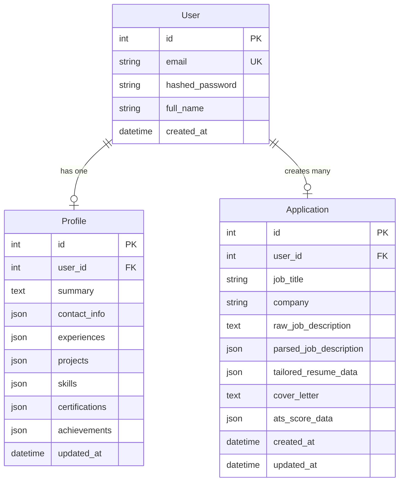

# AI Resume Tailoring Platform - Implementation Plan

This document outlines the design and plan for building the **AI Resume Tailoring Platform**, a web application that helps job seekers manage a structured master profile and generate tailored, ATS-friendly resumes and cover letters for specific job postings.

## User Review Required

> [!IMPORTANT]
> **OpenAI API Key & Model Configuration**
> We will configure the backend to use OpenAI's API. By default, we will use `gpt-4o-mini` for cost-effective parsing/analysis, and `gpt-4o` for high-quality tailoring. We require an `OPENAI_API_KEY` in the environment variables to run the platform.
>
> **Tailwind CSS Styling & Version**
> The design stack states "React + TypeScript + Vite + Tailwind CSS". As per system instructions, we require confirmation to use Tailwind CSS and which version is preferred (e.g., Tailwind v3 or v4). We recommend using Tailwind v4 or v3 (fallback) for clean responsive design.
>
> **Database Engine**
> We will configure the application using SQLAlchemy. For immediate local development, the app will auto-create and run on a local SQLite database (`resume_tailor.db`). In production, this can be seamlessly swapped to a PostgreSQL database by supplying the `DATABASE_URL` environment variable.

## Open Questions

> [!WARNING]
> 1. **Tailwind CSS Preference**: Should we proceed with Tailwind CSS? If yes, should we use Tailwind CSS v3 or v4? (If no, we will use standard Vanilla CSS).
> 2. **Authentication Flow**: For initial development, we will build standard email/password sign-up and login with JWT tokens. Should we include mock configurations for Google OAuth, or focus purely on username/password flow?
> 3. **Resume Parsers**: To parse PDF and DOCX files, we will use python libraries like `pypdf`/`pdfplumber` and `python-docx` to extract text, then feed it to the OpenAI parser. For image-based uploads, we will send the images directly to OpenAI's Vision model. Does this meet the parsing requirements?

---

## Proposed Changes

### Database Design

We will use SQLAlchemy ORM with the following relational schema. To make the resume structure highly flexible, experiences, projects, skills, etc. will be stored as JSON objects. This aligns perfectly with OpenAI API payloads and frontend states.



---

### Backend Component (`backend/`)

We will construct a FastAPI application. The folder hierarchy will look like:

- `backend/`
  - `.env.example`
  - `requirements.txt`
  - `app/`
    - `__init__.py`
    - `main.py` (App entrypoint & CORS config)
    - `config.py` (Pydantic settings)
    - `database.py` (SQLAlchemy engines & session setup)
    - `models.py` (SQLAlchemy models)
    - `schemas.py` (Pydantic validation schemas)
    - `auth.py` (JWT & password hashing utilities)
    - `routers/`
      - `auth.py` (Register, Login, Me endpoints)
      - `profile.py` (Upload resume, update structured profile)
      - `applications.py` (Create application, tailors resume, generates cover letter, calculates ATS, exports PDF)
    - `ai/`
      - `__init__.py`
      - `client.py` (OpenAI API connection logic)
      - `prompts.py` (Tailoring & parsing system prompts)
    - `pdf/`
      - `__init__.py`
      - `generator.py` (Playwright HTML-to-PDF rendering wrapper)
      - `templates/` (Beautiful CSS/HTML templates for printing resumes)

#### [NEW] [requirements.txt](file:///d:/Projects/TailorCV/backend/requirements.txt)
Dependencies to install:
```text
fastapi>=0.110.0
uvicorn>=0.28.0
sqlalchemy>=2.0.0
pydantic>=2.6.0
python-jose[cryptography]>=3.3.0
passlib[bcrypt]>=1.7.4
python-multipart>=0.0.9
openai>=1.14.0
playwright>=1.42.0
python-dotenv>=1.0.1
pypdf>=4.1.0
python-docx>=1.1.0
jinja2>=3.1.3
```

#### [NEW] [models.py](file:///d:/Projects/TailorCV/backend/app/models.py)
Database definitions for `User`, `Profile`, and `Application` models using SQLAlchemy.

#### [NEW] [schemas.py](file:///d:/Projects/TailorCV/backend/app/schemas.py)
Pydantic schemas for structured data transfer:
- `ResumeSchema`: structured representation of contact, summary, experience list, projects list, skills, certifications, and achievements.
- `JobDescriptionSchema`: extracted job details (title, company, required skills, preferred skills, responsibilities, experience level).
- `ATSEvaluationSchema`: structured response containing score, keyword coverage, missing keywords, strengths, recommendations, formatting notes.

#### [NEW] [ai/client.py](file:///d:/Projects/TailorCV/backend/app/ai/client.py)
A service class interacting with OpenAI's API. It uses structured JSON outputs (Pydantic model responses) to enforce structural compliance for:
- Parsing resumes (extracting experiences, projects, skills, certifications, etc.)
- Parsing job descriptions (extracting key criteria, keywords, experience levels)
- Tailoring resumes (prioritizing bullet points, emphasizing target responsibilities, matching style without lying)
- Evaluating ATS compliance (score, missing keywords, specific improvement steps)
- Writing Cover Letters

#### [NEW] [pdf/generator.py](file:///d:/Projects/TailorCV/backend/app/pdf/generator.py)
Uses Playwright Async API to render custom-built HTML templates to PDF. The template styling is done using standard CSS print styles ensuring clean page breaks and professional padding.

---

### Frontend Component (`frontend/`)

We will build a React + TypeScript single-page application initialized with Vite.

The app will feature:
1. **Authentication Screens**: Login / Register views.
2. **Dashboard**: List of current applications, overall statistics, and profile status.
3. **Master Profile Builder**: Guided forms (tabbed experience for Work Experience, Projects, Skills, Education, Certifications) and PDF/Docx drag-and-drop parser.
4. **New Application Wizard**: Step-by-step process:
   - Step 1: Paste/upload Job Description
   - Step 2: Extract & confirm JD properties
   - Step 3: Run AI Tailoring Engine
5. **Resume & Application Workspace**:
   - Split-screen view: Interactive Resume Editor (left side) and Real-time ATS Dashboard + Cover Letter Tab (right side).
   - "Regenerate Bullets" action: AI-driven line refinement.
   - Interactive PDF Preview and instant PDF Download button.

Layout Structure:
- `frontend/`
  - `src/`
    - `assets/` (custom styles/icons)
    - `components/` (shared inputs, modals, layout frames)
    - `context/` (Auth state, App state)
    - `pages/`
      - `Auth.tsx` (Sign in / Sign up page)
      - `Dashboard.tsx` (Overview of applications)
      - `Profile.tsx` (Master Resume record editor)
      - `ApplicationEditor.tsx` (Tailored editor + ATS check + cover letter)
    - `services/` (API wrapper using fetch / axios)
    - `types/` (TypeScript interfaces representing JSON models)
    - `App.tsx` (routing & auth guard checks)
    - `index.css` (global styles & custom theme tokens)

---

## Verification Plan

### Automated Tests
- We will write integration tests in `backend/tests/` to verify:
  1. Parsing endpoints (sending dummy text/documents and verifying structured output).
  2. Tailoring logic (confirming no fabricated facts are introduced and formatting is kept).
  3. Playwright PDF print generation (checking PDF file creation and header settings).
- We will use `pytest` for executing backend tests.

### Manual Verification
1. **Profile Parsing Test**: Upload a sample PDF resume, confirm successful text extraction, check that fields populate correctly in the profile forms.
2. **Resume Tailoring Test**: Input a master profile and a specific Software Engineer job description, review the tailored results, check the ATS evaluation panel, verify the generated cover letter.
3. **PDF Generation Test**: Export a tailored resume to PDF, open it, and inspect the styling, spacing, typography, and page breaks.
4. **Responsive Layouts Test**: Ensure the UI renders properly on desktop, tablet, and mobile views.
