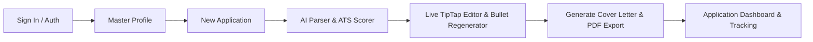
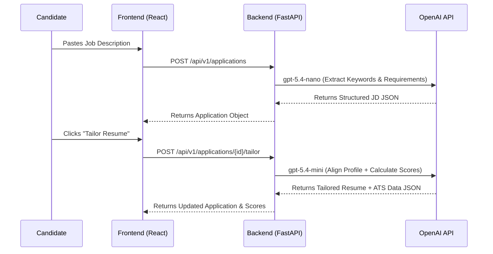

# Product Requirements Document (PRD) — TailorCV

---

## 1. Cover Page

```text
================================================================================
                    TAILORCV — PRODUCT REQUIREMENTS DOCUMENT
================================================================================
Product Name:        TailorCV (AI Resume & Job Application Tailoring Platform)
Document Owner:      Product & Engineering Team
Target Release:      Version 1.0.0 (MVP)
Document Status:     Approved / Final
Last Updated:        July 18, 2026
Core Frameworks:     React 19, TypeScript, Vite, TailwindCSS v4, FastAPI, Python 3.13,
                     SQLAlchemy, OpenAI (gpt-5.4-mini / gpt-5.4-nano), Playwright
================================================================================
```

---

## 2. Revision History

| Version | Date | Author | Description of Changes | Status |
| :--- | :--- | :--- | :--- | :--- |
| **0.1.0** | July 15, 2026 | Product Team | Initial draft for core architecture and API schemas | Draft |
| **0.9.0** | July 16, 2026 | Engineering | Added ATS scoring algorithm, Playwright PDF export specs | Review |
| **1.0.0** | July 18, 2026 | Full Stack Team | Finalized PRD with Google SSO, TipTap editor, & full feature specs | **Approved** |

---

## 3. Introduction

Modern recruitment processes rely heavily on Applicant Tracking Systems (ATS) to filter job applications before human review. Over 75% of qualified applicants fail initial automated screenings due to missing domain-specific keywords, incorrect section formatting, or unquantified experience bullets. 

**TailorCV** is an end-to-end AI-powered web platform designed to maximize job application conversion rates. By evaluating candidate profiles against target job descriptions, TailorCV automatically generates customized, ATS-friendly resumes, structured cover letters, actionable feedback, and an integrated job tracker dashboard.

---

## 4. Product Overview

TailorCV operates as a centralized career management workspace. Candidates maintain a single **Master Profile** (containing their complete work history, education, skills, projects, and achievements). When applying for a job, candidates paste the target **Job Description (JD)**. TailorCV parses the JD, benchmarks it against the candidate's profile, calculates a 4-factor ATS score, and generates a tailored resume and cover letter tailored to the specific role.

---

## 5. Problem Statement

1. **Low ATS Conversion Rates**: Generic resumes fail automated keyword screens.
2. **Application Exhaustion**: Manually rewriting resumes for 20+ applications per week requires 15–20 hours of manual work.
3. **Black Box Hiring**: Applicants receive no actionable insight into why their applications are filtered out.
4. **Disorganized Application Management**: Tracking application statuses, customized CV versions, and interview dates in spreadsheets leads to missed follow-ups.

---

## 6. Product Vision

To become the standard AI-driven career copilot for job seekers globally, eliminating friction in job applications while enabling candidates to present their authentic impact with mathematical precision and design excellence.

---

## 7. Goals & Objectives

* **Speed**: Reduce job tailoring and cover letter creation time from ~45 minutes to **< 5 seconds**.
* **ATS Compatibility**: Achieve target ATS match scores of **85%+** for tailored resumes.
* **Conversion Tracking**: Provide a single dashboard to track job applications across the entire lifecycle (Draft, Applied, Interviewing, Offered, Rejected).
* **Code Excellence**: Maintain 100% backend test pass rate and zero TypeScript compilation errors.

---

## 8. Target Audience

* **Active Job Seekers**: High-volume applicants submitting 10–50 applications weekly.
* **Software Engineers & Tech Professionals**: Candidates needing precise technical keyword matching (frameworks, databases, cloud tools).
* **Career Switchers**: Professionals recontextualizing past experience into a new target industry.
* **Recent Graduates**: Applicants needing AI assistance to quantify projects and academic work.

---

## 9. User Personas

### Persona 1: Marcus Vance — Senior Backend Engineer
* **Goal**: Apply to Senior Distributed Systems roles efficiently without spending 1 hour per submission.
* **Needs**: High-level bullet point polishing, architecture keyword alignment, dark-mode web UI.

### Persona 2: Sarah Jenkins — Junior Data Scientist
* **Goal**: Understand missing technical requirements in job descriptions and boost ATS compliance.
* **Needs**: Categorized missing keyword gap analysis (Critical vs. Contextual) and 1-click bullet regenerations.

---

## 10. User Journey



---

## 11. User Stories

| ID | As a... | I want to... | So that... |
| :--- | :--- | :--- | :--- |
| **US-1.0** | Job Seeker | Sign in using Email/Password or Google SSO | I can securely access my personal job workspace. |
| **US-2.0** | Candidate | Maintain a Master Profile with work, skills, and projects | I only enter my raw employment details once. |
| **US-3.0** | Candidate | Paste a Job Description to create a tailored application | The AI can extract key requirements and score my fit. |
| **US-4.0** | Applicant | See a breakdown of missing critical and contextual keywords | I know exactly what skills to emphasize. |
| **US-5.0** | Candidate | Edit my tailored resume live using a rich text editor and AI bullet variations | I can fine-tune every section before exporting. |
| **US-6.0** | Applicant | Download ATS-compliant PDF resumes and cover letters | I can submit professional PDFs to job portals. |
| **US-7.0** | Applicant | Track application statuses and set reminder dates | I never miss an interview or follow-up email. |

---

## 12. Functional Requirements

### 12.1 Authentication & Authorization
* **FR-1.1**: Email & Password registration/login with bcrypt password hashing.
* **FR-1.2**: Google OAuth 2.0 Single Sign-On (SSO) authentication.
* **FR-1.3**: JWT Bearer Token generation with 7-day expiration.
* **FR-1.4**: Public configuration endpoint (`/api/v1/auth/config`) to dynamically check SSO client availability.

### 12.2 Master Profile Management
* **FR-2.1**: Complete profile CRUD (Summary, Contact Info, Experience, Education, Skills, Projects, Certifications, Achievements).
* **FR-2.2**: Resume upload parser endpoint (`/api/v1/profile/upload`) to automatically populate Master Profile fields from uploaded PDF/DOCX files.

### 12.3 Job Processing & Application Management
* **FR-3.1**: Create application entries via Job Title, Company Name, Posting URL, and Raw Job Description.
* **FR-3.2**: Automated job description parsing into responsibilities, required skills, preferred tools, and soft skills using `gpt-5.4-nano`.
* **FR-3.3**: Duplicate application check endpoint (`/applications/check-duplicate`).
* **FR-3.4**: Application status state management (`Draft`, `Applied`, `Interviewing`, `Offered`, `Rejected`).
* **FR-3.5**: Application timeline audit logging (Creation, Resume Generation, Status Changes, Notes).

### 12.4 AI Resume Tailoring & Editing
* **FR-4.1**: 1-Click AI Resume Tailoring engine combining Master Profile data and extracted JD keywords (`gpt-5.4-mini`).
* **FR-4.2**: Live rich-text editing using TipTap editor.
* **FR-4.3**: AI Bullet Point Regenerator endpoint (`/applications/regenerate-bullet`) providing 3 alternative action-oriented variations with custom prompt inputs.

### 12.5 ATS Evaluation Engine
* **FR-5.1**: Multi-factor ATS Evaluation formula:
  $$\text{Overall Score} = (\text{ATS Compliance} \times 0.3) + (\text{Job Match} \times 0.4) + (\text{Content Quality} \times 0.2) + (\text{Writing Quality} \times 0.1)$$
* **FR-5.2**: Categorized Missing Keyword Analysis (`Critical`, `Recommended`, `Contextual`).
* **FR-5.3**: Keyword Coverage Groups (Programming Languages, Frameworks, Cloud, DevOps, Soft Skills).
* **FR-5.4**: Redundancy checks and profile validation flags.

### 12.6 Cover Letter & PDF Rendering
* **FR-6.1**: AI Cover Letter generation tailored to applicant profile and JD requirements.
* **FR-6.2**: Headless Chromium PDF Export using Playwright and Jinja2 HTML/CSS templates.
* **FR-6.3**: Plain text (.txt) cover letter export.

---

## 13. Non-Functional Requirements

### 13.1 Performance
* **NFR-1.1**: AI resume tailoring execution completed in **< 5 seconds**.
* **NFR-1.2**: PDF rendering and blob delivery completed in **< 2 seconds**.
* **NFR-1.3**: Frontend initial page load time **< 1 second**.

### 13.2 Usability & Design
* **NFR-2.1**: Premium Glassmorphism dark UI theme with custom Tailwind tokens (`--color-brand-500: #14b8a6`, `--color-bg-dark: #0f172a`).
* **NFR-2.2**: Fully responsive web design with Lucide React iconography.

### 13.3 Maintainability & Code Quality
* **NFR-3.1**: Strict TypeScript type safety across all components and API responses.
* **NFR-3.2**: Comprehensive backend test suite using `pytest` and `httpx`.

---

## 14. Feature Specifications

### 14.1 ATS Evaluation Dashboard Spec
* **Visual Components**: Radial progress chart for overall ATS score, category progress bars, expandable keyword chip badges (Green = Matched, Red = Missing).
* **Action Buttons**: "1-Click Apply Suggestions", "Regenerate Cover Letter", "Print PDF Resume".

### 14.2 TipTap Live Editor Spec
* **Controls**: Bold, Italic, Bullet List, Ordered List, Undo, Redo, AI Polish button.
* **AI Modal**: Select any bullet text -> Input custom instructions -> Receive 3 selectable metric-driven variations.

---

## 15. AI Capabilities & Workflows

### AI Model Assignments
1. **Parser & Structurer**: `gpt-5.4-nano` (Optimized for ultra-fast JSON extractions from raw unstructured text).
2. **Tailoring & Writer**: `gpt-5.4-mini` (Optimized for contextual reasoning, action verb selection, and metric quantification).



---

## 16. Data Requirements

### Database Schema (SQLite / SQLAlchemy)

#### Table: `users`
* `id`: Integer (Primary Key, Index)
* `email`: String (Unique, Index, Non-nullable)
* `hashed_password`: String (Nullable for OAuth users)
* `google_oauth_id`: String (Unique, Index, Nullable)
* `full_name`: String (Nullable)
* `created_at`: DateTime (UTC default)

#### Table: `profiles`
* `id`: Integer (Primary Key)
* `user_id`: Foreign Key (`users.id`, CASCADE Delete, Unique)
* `summary`: Text
* `contact_info`: JSON `{name, email, phone, location, website, linkedin, github}`
* `experiences`: JSON `[{company, position, location, start_date, end_date, description_bullets, current}]`
* `projects`: JSON `[{title, role, description_bullets, technologies, link}]`
* `education`: JSON `[{school, degree, field_of_study, start_date, end_date, gpa}]`
* `skills`: JSON `[{name, category}]`
* `certifications`: JSON `[{name, issuer, date, link}]`
* `achievements`: JSON `[{title, description, date}]`
* `updated_at`: DateTime

#### Table: `applications`
* `id`: Integer (Primary Key)
* `uid`: String (3-character alphanumeric identifier, e.g. `E3Z`)
* `user_id`: Foreign Key (`users.id`, CASCADE Delete)
* `job_title`: String
* `company`: String
* `raw_job_description`: Text
* `parsed_job_description`: JSON
* `tailored_resume_data`: JSON
* `cover_letter`: Text
* `ats_score_data`: JSON
* `status`: String (Default: `Draft`)
* `job_posting_url`: String
* `date_applied`: DateTime
* `timeline_events`: JSON `[{type, timestamp, message, notes}]`
* `reminder_date`: DateTime
* `reminder_notes`: Text
* `reminder_status`: String

---

## 17. High-Level API Requirements

| Method | Endpoint | Description | Request Body | Response |
| :--- | :--- | :--- | :--- | :--- |
| `POST` | `/api/v1/auth/register` | Register new user | `UserCreate` | `UserResponse` |
| `POST` | `/api/v1/auth/token` | User login (OAuth2 form) | `username, password` | `Token` |
| `POST` | `/api/v1/auth/google` | Google SSO authentication | `{ id_token }` | `Token` |
| `GET` | `/api/v1/auth/config` | Fetch auth configuration | None | `{ google_client_id }` |
| `GET` | `/api/v1/auth/me` | Fetch logged-in user | None | `UserResponse` |
| `GET` | `/api/v1/profile` | Get user Master Profile | None | `ProfileResponse` |
| `PUT` | `/api/v1/profile` | Update Master Profile | `ProfileUpdate` | `ProfileResponse` |
| `POST` | `/api/v1/profile/upload` | Upload resume to parse profile | `FormData (file)` | `ProfileResponse` |
| `GET` | `/api/v1/applications` | List user applications | None | `List[ApplicationResponse]` |
| `POST` | `/api/v1/applications` | Create new application | `ApplicationCreate` | `ApplicationResponse` |
| `POST` | `/api/v1/applications/{id}/tailor` | AI tailor resume & calculate ATS | None | `ApplicationResponse` |
| `POST` | `/api/v1/applications/{id}/cover-letter` | Generate AI cover letter | None | `ApplicationResponse` |
| `POST` | `/api/v1/applications/regenerate-bullet` | AI Bullet variations | `BulletRegenerateRequest` | `BulletRegenerateResponse` |
| `GET` | `/api/v1/applications/{id}/pdf` | Download Resume PDF | None | `Blob (application/pdf)` |
| `GET` | `/api/v1/applications/{id}/cover-letter/pdf` | Download Cover Letter PDF | None | `Blob (application/pdf)` |

---

## 18. UI/UX Requirements

* **Design Aesthetics**: Dark mode glassmorphism (`backdrop-filter: blur(16px)`), curated HSL slate/teal gradients, crisp Inter typography.
* **Component Architecture**:
  * `Auth.tsx`: Dual-panel glass card supporting Password & Google SSO sign-in.
  * `Profile.tsx`: Multi-tab editing interface for profile data management.
  * `Dashboard.tsx`: KanBan & Table views of active job applications with ATS score badges.
  * `ApplicationEditor.tsx`: Split-screen layout (Left: TipTap Live Editor & ATS Feedback, Right: Real-time PDF preview iframe).

---

## 19. Security & Privacy Requirements

* **Password Protection**: Passwords hashed using `bcrypt` (12 rounds) via `passlib`.
* **JWT Signing**: Bearer tokens signed with HS256 algorithm using secret key.
* **OAuth Security**: Server-side Google ID Token verification via Google OAuth2 `tokeninfo` endpoint checking `aud` and `iss`.
* **Data Isolation**: Database queries scoped strictly by authenticated `user_id`.
* **CORS Policy**: Middleware configured for local origins with option for production origin restrictions.

---

## 20. Error Handling & Edge Cases

| Scenario | Handling Strategy |
| :--- | :--- |
| **Invalid Google ID Token** | Returns HTTP 400 Bad Request: `"Invalid Google token"` |
| **Unregistered Google Client Origin** | User guided via configuration setup instructions to register origin in Google Cloud Console. |
| **OpenAI API Disruption** | Returns HTTP 503 Service Unavailable with human-readable error description. |
| **Duplicate Application Submission** | Backend duplicate check endpoint flags existing application by `company` + `job_title`. |
| **Empty Profile Upload** | Returns validation error prompting user to complete essential contact fields. |

---

## 21. Success Metrics (KPIs)

* **Resume Generation Success Rate**: > 99.5% completion without API timeout.
* **ATS Score Improvement**: Average score boost of **+35%** from candidate's initial un-tailored profile.
* **User Retention**: > 60% of registered users tailor 3+ applications within their first 7 days.
* **Page Load Speed**: Lighthouse Performance Score of **90+** on desktop.

---

## 22. Constraints

* **Database Engine**: SQLite local file database (`resume_tailor.db`) configured for fast single-instance local deployments.
* **PDF Rendering Runtime**: Requires Playwright Chromium binary installation on the host system.
* **Browser Runtime**: Node.js v20+ and Python 3.13 runtime requirements.

---

## 23. Assumptions

1. Target job descriptions are submitted in plain text or standard HTML.
2. The user has an active internet connection to reach OpenAI API endpoints and Google OAuth verification.
3. OpenAI models `gpt-5.4-nano` and `gpt-5.4-mini` are available in the configured workspace tier.

---

## 24. Risks & Mitigation

| Risk | Likelihood | Impact | Mitigation Plan |
| :--- | :--- | :--- | :--- |
| **OpenAI Token Quota Exceeded** | Low | High | Fall back gracefully to local deterministic keyword matching for ATS evaluation. |
| **Playwright Subprocess Locking on Windows** | Medium | Medium | Forced `WindowsProactorEventLoopPolicy` in `backend/app/main.py`. |
| **PDF Page Overflow** | Low | Low | Dynamic Jinja2 CSS spacing calculations based on total experience count. |

---

## 25. Out of Scope

* Automated job portal application submitting (web scraping/bot auto-fill).
* Video interview practice / AI mock interviews.
* Multi-user organization team accounts.
* Multi-currency billing / payment gateway integration.

---

## 26. Acceptance Criteria

* [x] **AC-1**: User can register, log in with password, or log in via Google SSO.
* [x] **AC-2**: User can create/update their Master Profile and parse an existing resume.
* [x] **AC-3**: User can paste a Job Description and generate a tailored resume and ATS score breakdown within 5 seconds.
* [x] **AC-4**: ATS score is calculated strictly via the 30/40/20/10 weighted formula.
* [x] **AC-5**: User can edit any bullet point in the TipTap editor and generate 3 AI variations.
* [x] **AC-6**: User can download clean, styled PDF resumes and cover letters.
* [x] **AC-7**: Application pipeline updates statuses, timeline events, and reminder dates accurately.

---

## 27. Future Enhancements

1. **Multi-Template Support**: Add executive, creative, and academic visual resume templates.
2. **Chrome Extension**: A browser extension to extract job descriptions directly from LinkedIn / Indeed with 1-click.
3. **LinkedIn Profile Sync**: Automated profile import from LinkedIn OAuth.
4. **Email Reminders**: Background cron task sending email alerts for upcoming job interview dates.
