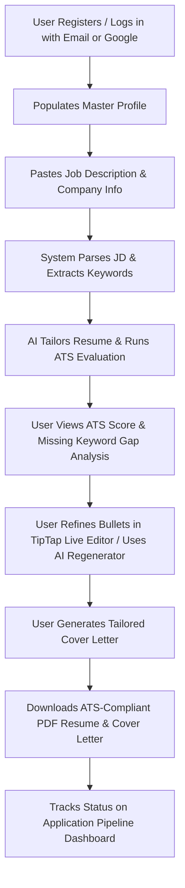

# TailorCV — Project Brief & Requirements Document

---

## 1. Project Information

| Field | Details |
| :--- | :--- |
| **Project Name** | TailorCV — AI-Powered Resume & Application Tailoring Platform |
| **Document Version** | 1.0.0 |
| **Date** | July 22, 2026 |
| **Tech Stack** | **Frontend**: React 19, TypeScript, Vite, TailwindCSS v4, Zustand, TanStack Query, TipTap Editor **Backend**: FastAPI (Python 3.13), SQLAlchemy, SQLite, OpenAI API (`gpt-5.4-nano` / `gpt-5.4-mini`), Playwright, Jinja2, Google SSO |
| **Document Status** | Final / Approved for MVP Development |

---

## 2. Executive Summary

**TailorCV** is an intelligent, full-stack web platform designed to streamline and automate the candidate job application process. Modern hiring pipelines heavily rely on Applicant Tracking Systems (ATS) to filter resumes based on keyword relevance, formatting compliance, and impact metrics before a human recruiter ever reads them. 

TailorCV enables job seekers to maintain a single Master Profile, paste any target Job Description (JD), and instantly receive:
1. An **ATS score and detailed gap analysis** categorized by critical, recommended, and contextual keywords.
2. A **tailored, highly relevant resume** customized specifically for the target position.
3. An **AI-generated cover letter** matching the job requirements.
4. An interactive **application pipeline dashboard** to track statuses, timeline events, and follow-up reminders.

---

## 3. Problem Statement

Job seekers face significant hurdles in today's automated hiring market:
* **ATS Filtering**: Up to 75% of qualified resumes are rejected by ATS parsers due to missing keywords, improper layout structures, or poor formatting.
* **Time-Consuming Customization**: Tailoring resumes and cover letters manually for dozens of job applications takes hours per application, leading to applicant burnout or generic, low-converting submissions.
* **Lack of Actionable Feedback**: Candidates rarely receive feedback on why their applications are rejected or how well their background matches a specific job post.
* **Disorganized Application Tracking**: Candidates struggle to manage applied jobs, follow-up dates, custom resume versions, and application statuses across spreadsheets and local folders.

---

## 4. Target Users

TailorCV serves job seekers across multiple experience levels:
* **Active Job Seekers**: Professionals applying to multiple roles weekly needing fast, tailored, high-converting resumes.
* **Career Changers & Transitioners**: Candidates highlighting transferable skills and contextual keywords to cross into new technical domains.
* **Recent Graduates & Entry-Level Professionals**: Applicants optimizing project experiences and core technical skills to pass initial ATS screens.
* **Experienced & Senior Engineers**: Professionals highlighting high-impact metrics, leadership achievements, and domain-specific keywords.

---

## 5. User Personas

### Persona A: Alex Chen — Mid-Level Full Stack Engineer
* **Background**: 3+ years experience, actively applying for Senior Frontend / Full-Stack roles.
* **Goals**: Tailor resume bullets for every application in under 5 minutes without generic buzzwords.
* **Pain Points**: Rejection emails from ATS scanners without knowing which missing skills caused the rejection.

### Persona B: Priya Sharma — Career Switcher (Data Analyst to AI Engineer)
* **Background**: 2 years in data analytics transitioning to Machine Learning / AI Engineering.
* **Goals**: Rephrase past analytical projects to align with modern AI engineering JDs.
* **Pain Points**: Hard to translate statistical modeling experience into production AI engineering terms.

---

## 6. Value Proposition

* **Instant ATS Match & Gap Analysis**: Quantitative evaluation score (0–100) broken down into ATS compliance (30%), Job Match (40%), Content Quality (20%), and Writing Quality (10%).
* **One-Click Resume & Cover Letter Tailoring**: Automated customization using high-performance AI models (`gpt-5.4-mini`).
* **Interactive AI Bullet Regeneration**: Inline option to generate 3 alternative variations of any bullet point with custom candidate instructions.
* **Master Profile Architecture**: Maintain skills, experience, and projects in one central hub—never retype profile data.
* **Integrated Job Application CRM**: End-to-end status tracking (Draft, Applied, Interviewing, Offered, Rejected) with automated reminders and audit logs.

---

## 7. Project Objectives

1. **Reduce Application Preparation Time**: Cut resume/cover letter customization time from ~45 minutes to < 2 minutes per job.
2. **Maximize ATS Pass Rates**: Achieve target ATS match scores above 85%+ through structured keyword integration.
3. **Provide Complete Transparency**: Give candidates a clear breakdown of missing skills (Critical, Recommended, Contextual).
4. **Deliver Premium UX/UI**: Offer an intuitive glassmorphic UI with live preview, TipTap rich text editing, and pixel-perfect PDF export via Playwright.

---

## 8. Functional Requirements (High-Level)

### 8.1 Authentication & User Management
* Email/Password registration and login with bcrypt password hashing.
* Google OAuth 2.0 (SSO) authentication.
* JWT Bearer token authentication session management.

### 8.2 Master Profile Management
* Dynamic forms for Personal Info, Executive Summary, Work Experience, Projects, Education, Skills, Certifications, and Achievements.
* Automated CV parsing/upload to seed Master Profile fields.

### 8.3 Job Application Management
* Create application entries via Job Title, Company Name, Posting URL, and Raw Job Description.
* AI-driven parsing of raw JDs into structured data (responsibilities, required skills, soft skills, seniority level).
* Duplicate application detection to prevent redundant submissions.
* Interactive status pipeline board and date-based follow-up reminders.

### 8.4 AI Resume Tailoring & Live Editing
* AI-generated resume tailored specifically to job description keywords and responsibilities.
* TipTap rich text editor for live resume customization.
* AI bullet point regenerator supplying 3 metric-driven variations per bullet.

### 8.5 ATS Evaluation & Scoring Engine
* Deterministic multi-factor scoring formula (0–100).
* Keyword coverage breakdown by category (Programming Languages, Frameworks, Cloud, DevOps, Soft Skills).
* Categorized missing keyword lists (Critical, Recommended, Contextual).
* Content quality, section score breakdowns, and profile validation flags.

### 8.6 Cover Letter Generator & PDF Export
* Tailored cover letter generation.
* Pixel-perfect PDF exporting using Playwright headless browser and Jinja2 HTML/CSS templates.
* Plain text (.txt) export support.

---

## 9. Minimum Viable Product (MVP) Scope

- [x] Secure JWT Email/Password & Google SSO Authentication.
- [x] Master Profile CRUD interface.
- [x] Job Application creation with AI Job Description parser.
- [x] AI Resume Tailoring Engine (`gpt-5.4-mini`).
- [x] Deterministic ATS Evaluation & Keyword Gap Analysis.
- [x] Cover Letter Generator (TXT & PDF exports).
- [x] Application Status Tracker with timeline events and reminders.
- [x] TipTap live resume bullet editor with AI regeneration variations.
- [x] Playwright PDF Export rendering engine.

---

## 10. Out of Scope (Future Releases)

* Auto-applying to job portals (LinkedIn, Indeed) via headless browser automation.
* Multi-user team or recruiter candidate review panels.
* Direct Integration with external calendar providers (Google Calendar / Outlook sync for reminders).
* Multi-language translation support for non-English JDs.

---

## 11. User Journey

---

## 12. Success Criteria

* **System Performance**: Resume tailoring & ATS scoring completion within < 5 seconds.
* **PDF Quality**: Clean, single-page or multi-page ATS-parseable PDF export without layout overflow.
* **Authentication Reliability**: Seamless registration/login via JWT and Google SSO.
* **Test Coverage**: 100% pass rate on backend unit and integration test suite (`pytest`).
* **Code Build Cleanliness**: 0 errors on frontend TypeScript production build (`tsc -b && vite build`).

---

## 13. Assumptions

1. Candidates provide accurate historical information in their Master Profile.
2. Target job descriptions are written in English.
3. Users run local development servers via Uvicorn (`port 8000`) and Vite (`port 5173`).
4. OpenAI API services remain accessible with valid API keys.

---

## 14. Project Risks & Mitigation Strategies

| Risk | Impact | Mitigation Strategy |
| :--- | :--- | :--- |
| **OpenAI API Rate Limits / Latency** | High | Implemented lightweight `gpt-5.4-nano` for parsing and structured JSON outputs with fallback options. |
| **PDF Rendering Layout Breakage** | Medium | Built Jinja2 templates using inline CSS layout rules rendered via Playwright headless Chromium. |
| **Google SSO Origin Mismatch** | Medium | Exposed `GET /api/v1/auth/config` to dynamically configure Client IDs and provided standard JavaScript Origin guides. |
| **Database Locks on Local SQLite** | Low | Managed scoped session lifetimes via FastAPI `Depends(get_db)` dependency injection. |

---

## 15. Constraints

* **Database**: Local SQLite storage (`resume_tailor.db`) configured for local single-user/development mode.
* **Browser Compatibility**: Playwright Chromium browser requirement for local backend PDF rendering.
* **Environment Variables**: Secret Keys, OpenAI API Keys, and Google Client IDs stored securely in `.env`.

---

## 16. Requirements Clarification

* **Token Expiry**: JWT access tokens are valid for 7 days (`ACCESS_TOKEN_EXPIRE_MINUTES = 60 * 24 * 7`).
* **ATS Scoring Weights**: Overall score calculation fixed at `ATS Compliance (30%) + Job Match (40%) + Content Quality (20%) + Writing Quality (10%)`.
* **Profile Synchronization**: Editing a tailored resume in an application creates an application-specific snapshot without overwriting the candidate's Master Profile.

---

## 17. Open Questions

1. Should future iterations support multiple visual resume template styles (e.g. Modern Minimalist, Two-Column, Executive)?
2. Should application reminder notifications trigger OS native desktop notifications or email alerts?

---

## 18. Approval & Next Steps

| Role | Status | Date |
| :--- | :--- | :--- |
| **Product Manager** | Approved | July 18, 2026 |
| **Lead Developer** | Approved | July 18, 2026 |
| **QA / Testing Lead** | Approved | July 18, 2026 |

### Next Steps:
1. Maintain existing MVP test suite coverage.
2. Deploy backend service to staging environment (e.g., Render / AWS EC2) with PostgreSQL migration if multi-tenant production hosting is desired.
3. Deploy frontend Vite static assets to Vercel / Netlify.
