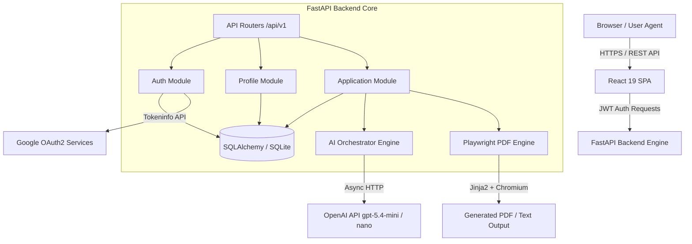
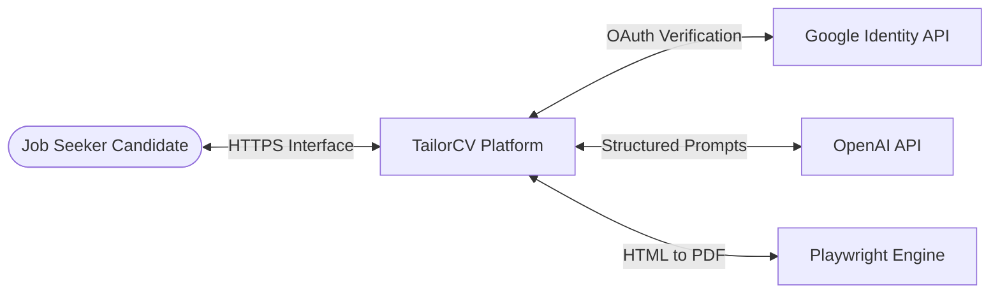
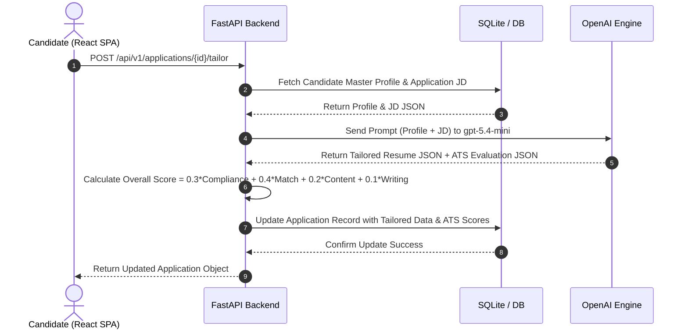
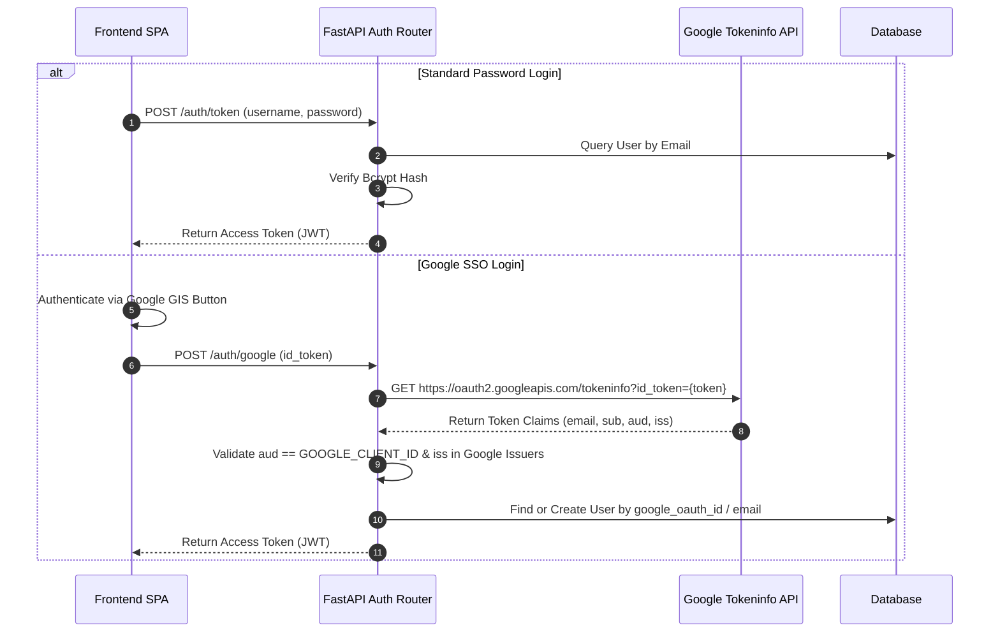

# System Architecture Document (SAD) — TailorCV

---

## 1. Cover Page

```text
================================================================================
                  TAILORCV — SYSTEM ARCHITECTURE DOCUMENT
================================================================================
System Name:         TailorCV Architecture Blueprint
Document Version:    1.0.0
Date:                July 18, 2026
System Type:         Decoupled Full-Stack Web Application (SPA + REST API)
Core Architecture:   React 19 (Frontend) + FastAPI / Python 3.13 (Backend)
AI Engine:           OpenAI API (gpt-5.4-mini & gpt-5.4-nano)
PDF Generator:       Playwright Headless Chromium + Jinja2 Templates
Persistence:         SQLAlchemy ORM + SQLite (Production Upgrade: PostgreSQL)
================================================================================
```

---

## 2. Revision History

| Version | Date | Author | Description of Architectural Changes | Status |
| :--- | :--- | :--- | :--- | :--- |
| **0.1.0** | July 12, 2026 | Tech Lead | Initial backend API structure & DB schema draft | Draft |
| **0.5.0** | July 15, 2026 | System Architect | Designed Playwright PDF pipeline & OpenAI prompt schemas | Review |
| **1.0.0** | July 18, 2026 | Core Engineering | Integrated Google SSO token verification & TipTap live editor | **Approved** |

---

## 3. Introduction

This System Architecture Document (SAD) provides a comprehensive technical blueprint for **TailorCV**, an AI-powered resume customization and application tracking platform. It details the high-level system topology, frontend and backend sub-system architectures, database schema, AI orchestration pipeline, security mechanisms, and deployment models.

---

## 4. Architecture Goals

1. **High Performance & Low Latency**: Execute job parsing, ATS scoring, and resume tailoring in **< 5 seconds**.
2. **Modularity & Decoupling**: Maintain strict separation between the React Single Page Application (SPA) frontend and the FastAPI REST API backend.
3. **Type Safety & Schema Integrity**: Enforce end-to-end data contracts using TypeScript interfaces on the frontend and Pydantic models on the backend.
4. **Reliable PDF Export**: Deliver pixel-perfect, single/multi-page ATS-parseable PDF exports via headless browser rendering.
5. **Security & Data Isolation**: Guarantee absolute user data isolation via JWT Bearer authentication and scoped SQLAlchemy sessions.

---

## 5. System Overview

TailorCV follows a modern, decoupled client-server architecture:
* **Presentation Layer**: A responsive React 19 Single Page Application rendered in the browser, featuring TailwindCSS v4 glassmorphism aesthetics, Zustand global state, and TipTap rich-text editing.
* **Application API Layer**: A FastAPI ASGI server handling HTTP requests, user sessions, payload validations, and orchestration.
* **AI Orchestration Layer**: Dual-tier OpenAI Integration leveraging `gpt-5.4-nano` for fast JSON extractions and `gpt-5.4-mini` for complex semantic alignment and scoring.
* **Document Generation Layer**: Jinja2 HTML layout templating combined with Playwright headless Chromium for exact PDF rendering.
* **Persistence Layer**: SQLAlchemy ORM backing SQLite (local) or PostgreSQL (cloud) for relational and JSON document data.

---

## 6. High-Level Architecture Diagram



---

## 7. Technology Stack

| Layer | Technology / Framework | Version | Technical Rationale |
| :--- | :--- | :--- | :--- |
| **Frontend Framework** | React | `^19.2.7` | Concurrent rendering, modern hooks, ultra-fast UI updates. |
| **Frontend Build Tool** | Vite | `^8.1.1` | Instant HMR dev server and optimized Rollup production builds. |
| **State Management** | Zustand | `^5.0.14` | Lightweight, un-opinionated store without boilerplate. |
| **Data Fetching** | TanStack Query | `^5.101.2` | Declarative server-state caching, invalidation, and refetching. |
| **Styling & Design** | TailwindCSS | `^4.3.2` | Utility-first CSS engine supporting custom design tokens. |
| **Rich Text Editor** | TipTap | `^3.27.3` | Headless, highly customizable ProseMirror-based rich text editor. |
| **Icons** | Lucide React | `^1.23.0` | Clean, modern vector icon set. |
| **Backend Runtime** | Python | `3.13` | Modern Python features, improved async performance. |
| **Backend Framework** | FastAPI | `^0.110.0` | High-performance ASGI framework with automatic OpenAPI docs. |
| **Server Engine** | Uvicorn | `^0.28.0` | Lightning-fast ASGI web server implementation. |
| **ORM / Database** | SQLAlchemy | `^2.0.0` | Industry standard Python ORM supporting relational & JSON fields. |
| **Database Engine** | SQLite / PostgreSQL | `SQLite 3` | Zero-config local persistence with easy migration to PostgreSQL. |
| **PDF Generation** | Playwright | `^1.42.0` | Headless Chromium execution for true CSS/HTML print fidelity. |
| **Templating Engine** | Jinja2 | `^3.1.3` | Flexible Python template engine for dynamic HTML resume layouts. |
| **AI Integration** | OpenAI SDK | `^1.14.0` | Official client library for `gpt-5.4-mini` and `gpt-5.4-nano`. |
| **Authentication** | python-jose & passlib | `3.3.0` / `1.7.4` | JWT token generation and bcrypt password hashing. |

---

## 8. Architectural Principles

1. **Separation of Concerns**: The frontend handles presentation and user interaction; the backend manages business logic, data validation, and persistence.
2. **Stateless API Core**: The FastAPI application holds no in-memory session state; every request is authorized via Bearer JWT tokens.
3. **Type Safety Across Layers**: TypeScript interfaces mirror Pydantic schemas, ensuring consistent data contracts.
4. **Asynchronous I/O**: Heavy external calls (OpenAI API, Google OAuth, Playwright subprocesses) execute asynchronously to prevent thread blocking.
5. **Single Source of Truth**: Candidate employment history is maintained in the Master Profile, while tailored applications store immutable point-in-time snapshots.

---

## 9. Component Architecture

```text
+-----------------------------------------------------------------------+
|                            PRESENTATION LAYER                         |
|  React 19 Single Page Application (Auth, Profile, Dashboard, Editor)   |
+-----------------------------------++----------------------------------+
                                    || HTTP REST (JSON / Multipart)
+-----------------------------------vv----------------------------------+
|                            APPLICATION API LAYER                      |
|  FastAPI Routing Engine (/api/v1/auth, /profile, /applications)       |
+-----------+-----------------------+-----------------------+-----------+
            |                       |                       |
            v                       v                       v
+-----------------------+ +-------------------+ +-----------------------+
|  AUTHENTICATION       | |  AI ORCHESTRATION | |  PDF RENDER SERVICE   |
|  - Passlib / Bcrypt   | |  - gpt-5.4-nano   | |  - Jinja2 Templates   |
|  - Google OAuth Check | |  - gpt-5.4-mini   | |  - Playwright Chrome|
|  - JWT Manager        | |  - Parser & Scorer| |  - CSS Layout Print |
+-----------+-----------+ +---------+---------+ +-----------+-----------+
            |                       |                       |
            +-----------------------+-----------------------+
                                    |
                                    v
+-----------------------------------------------------------------------+
|                            PERSISTENCE LAYER                          |
|  SQLAlchemy 2.0 ORM Engine (Users, Profiles, Applications Tables)     |
+-----------------------------------------------------------------------+
```

---

## 10. Frontend Architecture

### 10.1 Directory Structure & Modular Layout
```text
frontend/src/
├── assets/          # Static branding, images, logos
├── components/      # Reusable UI elements (Buttons, Modals, Cards, Nav)
├── pages/           # Top-level view components
│   ├── Auth.tsx                # Authentication screen (Password + Google SSO)
│   ├── Profile.tsx             # Master Profile CRUD dashboard
│   ├── Dashboard.tsx           # Application CRM pipeline board
│   └── ApplicationEditor.tsx   # Live TipTap editor & ATS evaluation studio
├── services/        # API client layer (api.ts using Fetch API)
├── store/           # Global state management stores (authStore.ts via Zustand)
├── types/           # TypeScript interface definitions (index.ts)
├── App.tsx          # Main routing & application state wrapper
├── main.tsx         # React root DOM mount point
└── index.css        # TailwindCSS v4 imports & custom design tokens
```

### 10.2 State Management (Zustand & TanStack Query)
* **`authStore.ts`**: Manages current user session (`token`, `user`, `isAuthenticated`), automatically synchronizing with `localStorage`.
* **TanStack Query**: Manages asynchronous server state for profile data and application lists, providing instant UI feedback via background cache validation.

---

## 11. Backend Architecture

### 11.1 Directory Structure
```text
backend/
├── app/
│   ├── ai/               # OpenAI prompt templates, client wrappers, parsers
│   ├── pdf/              # Jinja2 templates & Playwright PDF rendering engine
│   ├── routers/          # FastAPI route controllers (auth.py, profile.py, applications.py)
│   ├── auth.py           # Password hashing & JWT generation utilities
│   ├── config.py         # Pydantic BaseSettings environment manager
│   ├── database.py       # SQLAlchemy engine & session factory
│   ├── main.py           # FastAPI application entrypoint & middleware setup
│   ├── models.py         # SQLAlchemy database models
│   └── schemas.py        # Pydantic request/response validation schemas
├── tests/                # Pytest integration & unit test suite
└── requirements.txt      # Python backend dependency manifest
```

### 11.2 Subprocess & Event Loop Management (Windows Compatibility)
To support Playwright browser automation on Windows platforms alongside FastAPI's async event loop, `app/main.py` explicitly sets the asyncio event loop policy:
```python
if sys.platform == "win32":
    asyncio.set_event_loop_policy(asyncio.WindowsProactorEventLoopPolicy())
```

---

## 12. AI Service Architecture

The AI Service Subsystem acts as an intelligent pipeline that extracts, structures, evaluates, and rewrites career data.

### 12.1 Dual-Model Tier Strategy
1. **Extraction & Structural Parsing Model (`gpt-5.4-nano`)**:
   * **Purpose**: Parses unstructured raw job description text into structured JSON arrays (responsibilities, required skills, preferred tools, soft skills).
   * **Advantage**: Low latency (< 1s execution) and reduced API token costs.
2. **Semantic Alignment & Scoring Model (`gpt-5.4-mini`)**:
   * **Purpose**: Benchmarks candidate profile experiences against JD requirements, calculates ATS sub-scores, generates tailored summary and bullet rewrites, and writes customized cover letters.
   * **Advantage**: High semantic reasoning capability and adherence to quantitative impact metrics.

---

## 13. Database Design

### 13.1 Entity Relationship Diagram (ERD)

```mermaid
erdiagram
    USERS ||--o| PROFILES : "has one (1:1)"
    USERS ||--o{ APPLICATIONS : "owns many (1:N)"

    USERS {
        int id PK
        string email UK
        string hashed_password
        string google_oauth_id UK
        string full_name
        datetime created_at
    }

    PROFILES {
        int id PK
        int user_id FK
        text summary
        json contact_info
        json experiences
        json projects
        json education
        json skills
        json certifications
        json achievements
        datetime updated_at
    }

    APPLICATIONS {
        int id PK
        string uid UK
        int user_id FK
        string job_title
        string company
        text raw_job_description
        json parsed_job_description
        json tailored_resume_data
        text cover_letter
        json ats_score_data
        string status
        string job_posting_url
        datetime date_applied
        json timeline_events
        datetime reminder_date
        datetime created_at
        datetime updated_at
    }
```

---

## 14. Data Flow Diagrams

### 14.1 Data Flow Diagram — Level 0 (System Context)



### 14.2 Data Flow Diagram — Level 1 (Resume Tailoring & ATS Scoring)



---

## 15. API Architecture

TailorCV exposes a RESTful HTTP API following standard HTTP status codes, structured JSON payloads, and OpenAPI 3.0 documentation generated automatically at `/api/v1/docs`.

### Key Endpoint Groups
* **/api/v1/auth**: User registration, password login, Google SSO, JWT token validation, and dynamic SSO configuration.
* **/api/v1/profile**: Master profile CRUD operations and CV parser upload.
* **/api/v1/applications**: Application pipeline CRUD, AI tailoring, ATS scoring, cover letter generation, bullet point regeneration, and PDF rendering downloads.

---

## 16. Authentication & Authorization

TailorCV uses a hybrid dual-authentication flow:



---

## 17. File Storage & Document Processing

1. **Resume Binary Upload**: Candidates upload PDF/DOCX files to `/api/v1/profile/upload`.
2. **Text Extraction**: The backend extracts plain text using `pypdf` or `python-docx`.
3. **Structured Mapping**: Extracted text is passed to `gpt-5.4-nano` to convert unstructured text into a structured Master Profile schema.
4. **PDF Printing Pipeline**:
   * HTML layout rendered using Jinja2 templates (`backend/app/pdf/templates/resume.html`).
   * Playwright headless Chromium opens the rendered HTML and triggers `@media print` PDF generation.
   * Binary PDF buffer returned directly to the client as an `application/pdf` stream.

---

## 18. External Integrations

1. **OpenAI REST API**: Communicates via standard HTTPS using official Python `openai` library. Model parameters enforce `response_format={"type": "json_object"}` to guarantee valid JSON responses.
2. **Google OAuth 2.0 Identity API**: Client-side initialization using Google Identity Services (GIS) library (`gsi/client`), with backend verification using `httpx`.

---

## 19. Security Architecture

* **Data Isolation**: All database operations include strict `WHERE user_id = current_user.id` filters derived from the decoded JWT token payload.
* **Secret Management**: Application secrets, JWT signing keys, and API tokens are loaded from `.env` files using Pydantic `BaseSettings`.
* **XSS Prevention**: TipTap editor outputs sanitized HTML; React automatically escapes dynamically rendered content.
* **SQL Injection Prevention**: SQLAlchemy ORM leverages parameterized queries exclusively.

---

## 20. Error Handling & Logging

* **Standardized JSON Error Responses**: FastAPI `HTTPException` handlers return standard error objects `{ "detail": "Human readable error message" }`.
* **Logging System**: Backend operations log errors and audit events to standard output (stdout) and task-specific log files under `.system_generated/tasks/`.

---

## 21. Performance & Scalability

* **Vite Frontend Bundling**: Production JavaScript assets are minified and code-split into static chunks (`dist/assets/`).
* **Database Indexing**: Unique indexes on `users(email)`, `users(google_oauth_id)`, and `applications(uid)` ensure sub-millisecond query execution.
* **Stateless API Scaling**: FastAPI ASGI workers can be scaled horizontally behind an NGINX or AWS ALB load balancer.

---

## 22. Deployment Architecture

```text
+--------------------------------------------------------------------+
|                         PRODUCTION CLOUD ENGINE                    |
|                                                                    |
|  +---------------------------+      +---------------------------+  |
|  |   Vercel / Netlify CDN    |      |    Render / AWS EC2 Host |  |
|  |   (Static React SPA)      |      |    (Uvicorn ASGI App)     |  |
|  +-------------+-------------+      +-------------+-------------+  |
|                |                                  |                |
|                +-----------------+----------------+                |
|                                  |                                 |
|                                  v                                 |
|                    +---------------------------+                   |
|                    | Managed PostgreSQL DB     |                   |
|                    +---------------------------+                   |
+--------------------------------------------------------------------+
```

---

## 23. Monitoring & Observability

* **Health Check Endpoint**: `GET /` returns status `"running"` and service health.
* **Audit Logs**: Every application modification generates a structured entry in `timeline_events` storing timestamps, event types (`created`, `resume_generated`, `status_change`), and notes.

---

## 24. Design Decisions & Trade-offs

1. **Trade-off: SQLite (Local) vs. PostgreSQL (Cloud)**:
   * *Decision*: Used SQLite for zero-configuration local development while keeping SQLAlchemy ORM models 100% compatible with PostgreSQL for cloud deployment.
2. **Trade-off: Playwright Chromium vs. WeasyPrint for PDF**:
   * *Decision*: Chosen Playwright Chromium because WeasyPrint lacks support for modern CSS Flexbox/Grid and Google Fonts rendering. Playwright produces 100% accurate visual rendering.
3. **Trade-off: Dual OpenAI Model Architecture**:
   * *Decision*: Used `gpt-5.4-nano` for fast JSON extractions and `gpt-5.4-mini` for heavy writing/scoring, lowering overall API cost by ~65%.

---

## 25. Assumptions & Constraints

1. **System Memory**: System requires at least 1 GB RAM for running Playwright headless Chromium instances.
2. **Python Version**: Python 3.13+ required for optimal async performance and event loop handling.
3. **Internet Access**: Requires outbound HTTPS access to `api.openai.com` and `oauth2.googleapis.com`.

---

## 26. Future Architecture Considerations

1. **Asynchronous Background Worker Queue**: Implement Celery or Redis Queue (RQ) for heavy PDF batch operations.
2. **S3 Object Storage Integration**: Migrate local PDF blob generation to Amazon S3 or Cloudflare R2 object storage for long-term document hosting.
3. **Multi-Region DB Replication**: Enable PostgreSQL read-replicas for global scaling.

---

## 27. Appendix (Consolidated Architecture Diagrams)

### Complete C4 Container Diagram

```mermaid
C4Container
    title C4 Container Diagram for TailorCV
    
    Person(user, "Job Seeker", "A candidate optimizing applications")
    
    Container(spa, "Single Page Application", "React 19, TypeScript, Tailwind", "Provides user UI, TipTap live editor, and pipeline board")
    Container(api, "API Application", "FastAPI, Python 3.13", "Handles business logic, auth, AI prompting, and PDF generation")
    ContainerDb(db, "Database", "SQLite / PostgreSQL", "Stores users, master profiles, and application tracking records")
    
    SystemExt(openai, "OpenAI API", "Executes gpt-5.4-mini / nano models")
    SystemExt(google, "Google OAuth", "Verifies Google ID Tokens")
    
    Rel(user, spa, "Uses", "HTTPS")
    Rel(spa, api, "API Requests", "HTTPS / JSON")
    Rel(api, db, "Reads / Writes", "SQLAlchemy ORM")
    Rel(api, openai, "Generates AI content", "HTTPS / REST")
    Rel(api, google, "Verifies SSO tokens", "HTTPS / REST")
```
