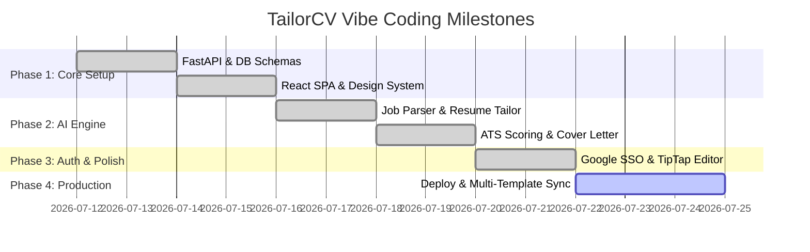
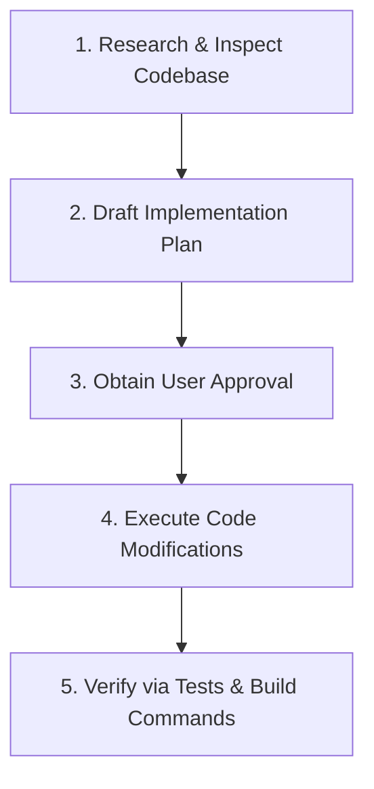
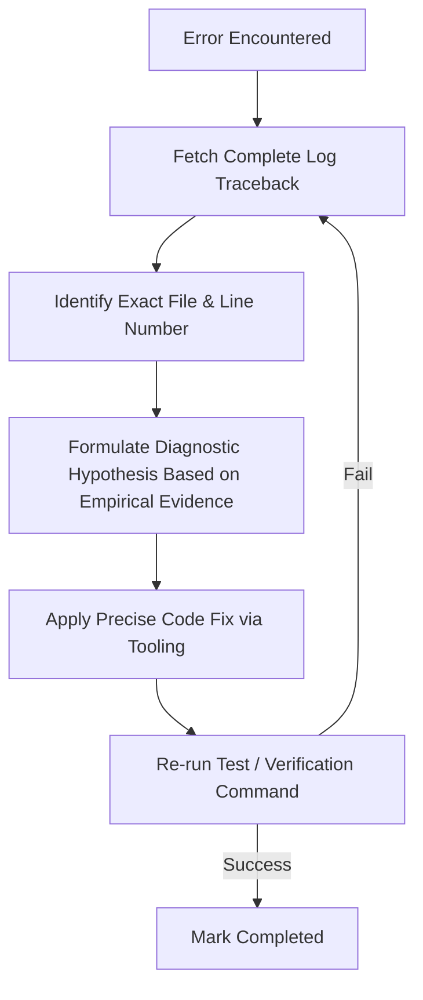

# Vibe Coding Specification — TailorCV

---

## 1. Cover Page

```text
================================================================================
                    TAILORCV — VIBE CODING SPECIFICATION
================================================================================
Document Title:      Vibe Coding Specification & AI Development Guidelines
Target Project:      TailorCV (AI Resume & Job Application Tailoring Platform)
Document Version:    1.0.0
Date:                July 18, 2026
Methodology:         AI-Assisted Pair Programming (Vibe Coding)
Target Stack:        React 19, TypeScript, Vite, TailwindCSS v4, FastAPI, Python 3.13,
                     OpenAI API (gpt-5.4-mini / nano), Playwright, Jinja2
================================================================================
```

---

## 2. Revision History

| Version | Date | Author | Description of Changes | Status |
| :--- | :--- | :--- | :--- | :--- |
| **0.1.0** | July 15, 2026 | AI Engineering Team | Initial Vibe Coding principles and prompt templates | Draft |
| **1.0.0** | July 18, 2026 | Full Stack Lead | Standardized AI workflow, debugging rules, & Definition of Done | **Approved** |

---

## 3. Purpose

This document establishes the operational framework, coding standards, prompt patterns, and development constraints for **Vibe Coding** on the **TailorCV** platform. Vibe Coding is an agile, AI-assisted development methodology where developers partner with agentic AI assistants (such as Antigravity) to rapidly plan, build, debug, and verify software with high visual excellence and strict technical rigors.

---

## 4. Development Philosophy

1. **Velocity Without Compromise**: Leverage AI capabilities for rapid prototyping and boilerplating while maintaining strict type safety, zero linter errors, and 100% test verification.
2. **Visual Excellence First**: Deliver premium, state-of-the-art UI/UX (dark mode glassmorphism, tailored HSL color palettes, dynamic micro-animations) from the very first turn—never settle for MVP placeholder designs.
3. **Empirical Verification**: Never claim a feature is complete without running real build or test commands (`pytest`, `npm run build`) to verify execution output empirically.
4. **No Assumptions / Code Search First**: Inspect exact source files, function signatures, and logs before forming diagnostic hypotheses or writing code.

---

## 5. Project Context for AI

**TailorCV** is a full-stack platform that tailors resumes and cover letters using OpenAI models based on target Job Descriptions (JDs), evaluates ATS compliance across 4 dimensions, and manages application lifecycles.

```text
       +-----------------------------------------------------------------+
       |                        TAILORCV ECOSYSTEM                       |
       +-----------------------------------------------------------------+
                                        |
       +--------------------------------+--------------------------------+
       |                                                                 |
       v                                                                 v
+-----------------------------+                   +-----------------------------+
|    FRONTEND (Vite / React)   |                   |    BACKEND (FastAPI / Py)   |
| - React 19, TypeScript      | <--- REST API --->| - Python 3.13, FastAPI      |
| - TailwindCSS v4            |   (Port 8000)     | - SQLAlchemy 2.0 + SQLite   |
| - Zustand, TanStack Query   |                   | - OpenAI gpt-5.4-mini/nano  |
| - TipTap Rich Text Editor   |                   | - Playwright PDF Generator  |
| - Google Identity SSO       |                   | - Bcrypt & JWT Security     |
+-----------------------------+                   +-----------------------------+
```

---

## 6. Coding Standards

### 6.1 TypeScript & React (Frontend)
* **Strict Type Annotations**: Avoid `any` types. All API models must match backend Pydantic definitions in `frontend/src/types/index.ts`.
* **Component Structure**: Functional components only. Use custom hooks for complex logic.
* **Styling**: Vanilla CSS tokens inside Tailwind v4 (`@theme`) combined with utility classes. Do not use ad-hoc hardcoded pixel offsets where flexible layouts apply.

### 6.2 Python & FastAPI (Backend)
* **PEP 8 Compliance**: Explicit type hints on all function parameters and return types (`def get_user(db: Session = Depends(get_db)) -> User:`).
* **Pydantic Schemas**: Use `BaseModel` schemas for all request/response validation.
* **Async Handlers**: Use `async def` for endpoints performing network I/O (`httpx`, `openai`) or subprocess calls.

---

## 7. Project Structure

```text
d:/Projects/TailorCV/
├── backend/
│   ├── app/
│   │   ├── ai/          # OpenAI prompt wrappers & parsers
│   │   ├── pdf/         # Jinja2 templates & Playwright generator
│   │   ├── routers/     # Route modules (auth.py, profile.py, applications.py)
│   │   ├── auth.py      # Password hashing & JWT generation
│   │   ├── config.py    # Pydantic BaseSettings
│   │   ├── database.py  # SQLAlchemy engine & session maker
│   │   ├── main.py      # Application entrypoint & CORS middleware
│   │   ├── models.py    # SQLAlchemy database models
│   │   └── schemas.py   # Pydantic validation schemas
│   ├── tests/           # Pytest integration tests
│   └── .env             # Server environment variables
├── frontend/
│   ├── src/
│   │   ├── assets/      # Static visual assets
│   │   ├── components/  # Shared React UI components
│   │   ├── pages/       # Page components (Auth, Profile, Dashboard, ApplicationEditor)
│   │   ├── services/    # API fetch functions (api.ts)
│   │   ├── store/       # Zustand stores (authStore.ts)
│   │   └── types/       # TypeScript type definitions
│   └── package.json
└── README.md
```

---

## 8. Development Rules & Constraints

1. **No Placeholders**: Never use placeholder text or dummy images. Always use real code or generated production-grade assets.
2. **Inspect Logs First**: Never diagnose errors without fetching un-truncated console/pytest logs.
3. **No Superficial Symptom Patches**: Fix root causes instead of swallowing exceptions or commenting out failing assertions.
4. **Preserve Existing Comments**: Preserve all existing file comments and docstrings.
5. **Exact Method Signatures**: Verify component prop names and function signatures in the codebase before calling them.

---

## 9. Tech Stack Configuration

* **Backend Dev Server**: `.\venv\Scripts\python -m uvicorn app.main:app --reload --port 8000`
* **Frontend Dev Server**: `npm run dev` (Runs on `http://localhost:5173`)
* **Backend Unit Testing**: `$env:PYTHONPATH="backend"; .\venv\Scripts\pytest backend/tests/test_main.py`
* **Frontend Production Build**: `npm run build` (Executes `tsc -b && vite build`)

---

## 10. Architecture Context for AI

When generating code, the AI must respect TailorCV's architecture:
* **Master Profile vs. Application Snapshots**: Editing profile details in an application updates `tailored_resume_data` for that specific application only.
* **Deterministic ATS Scoring Formula**:
  $$\text{Score} = (\text{ATS Compliance} \times 0.3) + (\text{Job Match} \times 0.4) + (\text{Content Quality} \times 0.2) + (\text{Writing Quality} \times 0.1)$$
* **Windows Playwright Policy**: `main.py` must maintain `asyncio.set_event_loop_policy(asyncio.WindowsProactorEventLoopPolicy())`.

---

## 11. Feature Development Plan



---

## 12. AI Development Workflow

The AI assistant follows a disciplined 5-step development loop:



---

## 13. Prompting Guidelines

To get the highest quality output during Vibe Coding sessions:
* **Be Specific**: Specify target components, file paths, and visual expectations.
* **Use Direct Directives**: E.g., *"Implement Google SSO login handling in `Auth.tsx` using the `api.auth.googleLogin` endpoint."*
* **Attach Visuals**: Upload screenshots of layout issues or console error tracebacks directly to the chat context.

---

## 14. Context Management Strategy

* **Knowledge Items (KIs)**: Review repository knowledge summaries before undertaking architectural changes.
* **Conversation Logs**: Trace past decisions by reviewing `transcript.jsonl` logs when debugging complex edge cases.
* **Artifact Tracking**: Maintain living `task.md`, `implementation_plan.md`, and `walkthrough.md` documents throughout multi-step feature developments.

---

## 15. Git Workflow & Version Control

* **Branch Strategy**: Feature branches off `main` (e.g. `feature/google-sso-auth`, `fix/playwright-windows-loop`).
* **Commit Message Format**:
  * `feat(auth): add Google OAuth 2.0 token verification endpoint`
  * `fix(pdf): update Playwright event loop policy for Windows runtime`
  * `style(ui): update Auth page glassmorphic container styling`

---

## 16. Testing Strategy During Development

1. **Unit & API Testing**: Run targeted backend tests immediately after modifying endpoints:
   ```bash
   $env:PYTHONPATH="backend"; .\venv\Scripts\pytest backend/tests/test_main.py -k "auth_google"
   ```
2. **Frontend Type Checking & Bundling**: Execute build check after editing React components:
   ```bash
   npm run build
   ```

---

## 17. Code Review Checklist

Before approving any AI-generated PR or code edit:
- [ ] Are all new backend inputs validated via Pydantic schemas?
- [ ] Are TypeScript types explicitly defined (no `any`)?
- [ ] Is password hashing using `bcrypt` and token verification using Google's `tokeninfo` API?
- [ ] Does the UI render cleanly on both desktop and mobile viewports?
- [ ] Did `pytest` pass with 0 failures?

---

## 18. Error Recovery & Debugging Strategy



---

## 19. Security Guidelines

* **Secret Protection**: Never hardcode API keys or secret tokens. Access them through `app.config.settings` backed by `.env`.
* **OAuth Security**: Validate Google ID token issuer (`iss`) and audience (`aud`) against configured Client IDs.
* **Data Isolation**: Filter all queries by `user_id` extracted from the decoded JWT payload.

---

## 20. Performance Guidelines

* **Model Splitting**: Use `gpt-5.4-nano` for extraction/parsing and `gpt-5.4-mini` for semantic tailoring to minimize response latency and token usage.
* **Async Network Calls**: Use `httpx.AsyncClient` for non-blocking HTTP verification requests.

---

## 21. Definition of Done (DoD)

A feature is considered **Done** when:
1. All functional requirements specified in the implementation plan are met.
2. `pytest` backend tests execute with 100% pass rate.
3. `npm run build` completes with 0 errors.
4. `task.md` items are fully checked off.
5. A detailed `walkthrough.md` document is generated with verification results.

---

## 22. Development Milestones

| Milestone | Key Deliverable | Target Date | Status |
| :--- | :--- | :--- | :--- |
| **M1: Core Engine** | FastAPI Backend, Database Schema & Master Profile API | July 14, 2026 | Completed |
| **M2: AI Tailoring** | `gpt-5.4` prompt pipelines, ATS evaluation engine & Cover Letter generator | July 18, 2026 | Completed |
| **M3: UI & SSO** | Glassmorphic React SPA, Google SSO integration & TipTap Editor | July 22, 2026 | Completed |
| **M4: Production Deployment**| Cloud hosting setup (Vercel + Render + PostgreSQL migration) | July 25, 2026 | In Progress |

---

## 23. Risks & Mitigation

| Risk | Impact | Mitigation Strategy |
| :--- | :--- | :--- |
| **AI Prompt Hallucination** | Medium | Enforce `response_format={"type": "json_object"}` and validate via Pydantic response models. |
| **Google SSO Origin Mismatch** | Low | Expose dynamic `/auth/config` endpoint and supply clear Cloud Console origin setup guide. |
| **Windows Playwright Subprocess Deadlock**| High | Set `WindowsProactorEventLoopPolicy` on server startup. |

---

## 24. Appendix — Reference Prompts, Checklists & Standards

### Copy-Paste Prompt: New Feature Implementation
```text
I want to implement [Feature Name] in TailorCV.
Please follow our Vibe Coding workflow:
1. Inspect existing files in backend/app/ and frontend/src/.
2. Create an implementation_plan.md artifact with proposed backend schemas, routers, and frontend UI changes.
3. Wait for my approval before modifying any code.
```

### Copy-Paste Prompt: Bug Debugging
```text
I am encountering an error when running [Command / Action].
Please fetch the complete log output, identify the exact root cause in the source code, and propose a precise fix without swallowing exceptions or adding dummy fallbacks.
```
